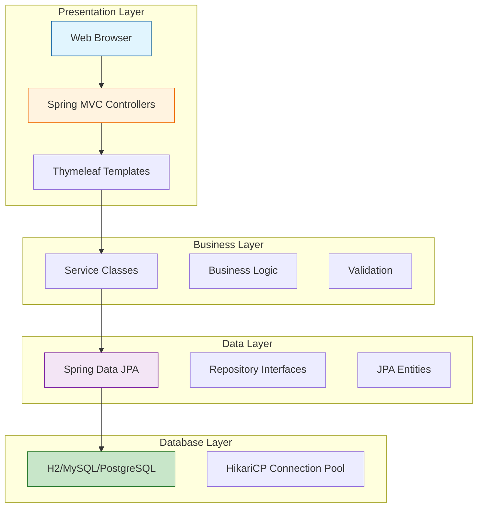
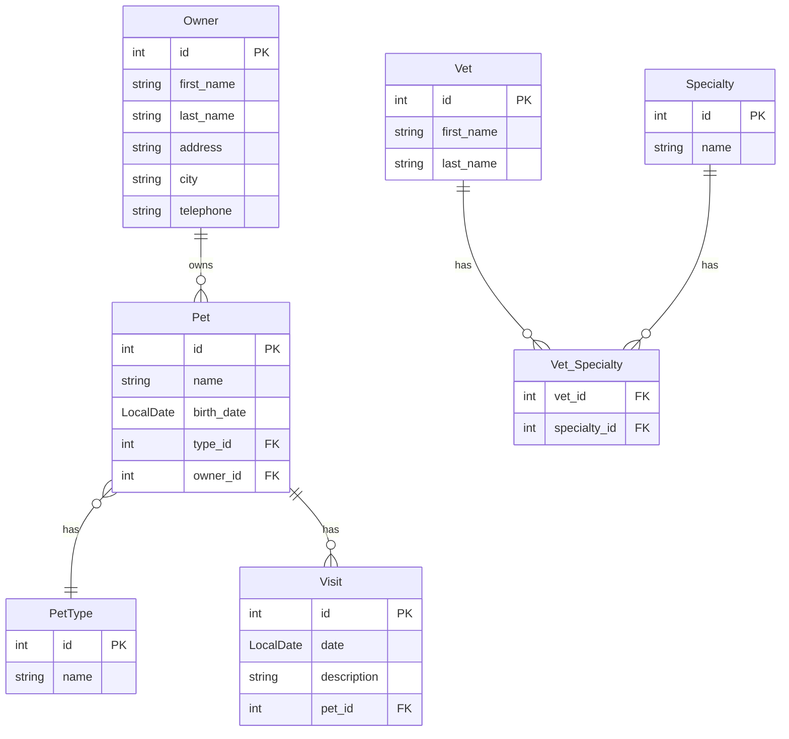
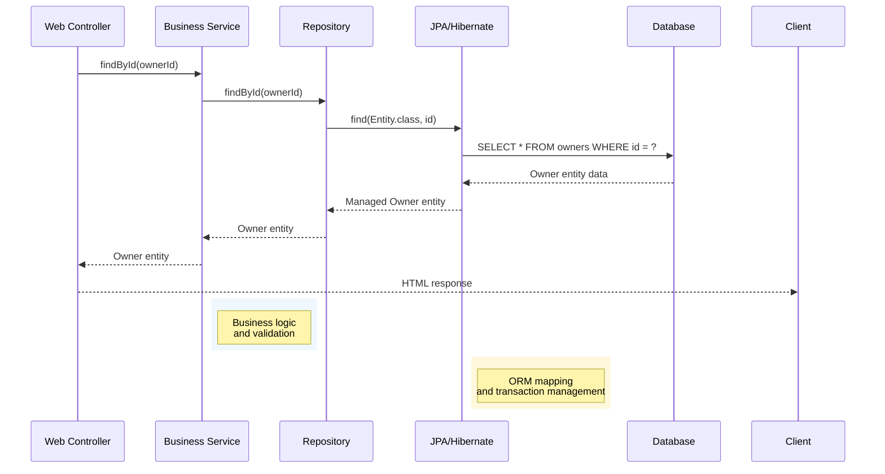

# Architecture Guide

This document describes the architecture, design patterns, and technical decisions of the Spring PetClinic application.

## Overview

Spring PetClinic is a classic three-tier web application demonstrating Spring Boot best practices. It follows a clean architecture with clear separation of concerns, making it an ideal reference implementation for enterprise applications.

## Technology Stack

### Core Framework

- **Spring Boot 4.0.0** - Application framework and auto-configuration
- **Spring MVC** - Web layer with RESTful controllers
- **Spring Data JPA** - Data access layer with repository pattern
- **Hibernate** - Object-Relational Mapping (ORM)
- **Thymeleaf** - Server-side templating engine
- **Spring Boot Actuator** - Application monitoring and management

### Database Layer

- **H2** (default) - In-memory database for development
- **MySQL** - Production-ready relational database
- **PostgreSQL** - Alternative production database
- **Spring JDBC** - Database connection management
- **Connection Pooling** - HikariCP (default)

### Frontend Technologies

- **Bootstrap 5** - Responsive CSS framework
- **WebJars** - Client-side dependency management
- **Font Awesome** - Icon library
- **jQuery** - JavaScript utilities

### Build and Deployment

- **Maven** - Build tool and dependency management
- **Gradle** - Alternative build system
- **Spring Boot Build Plugin** - Application packaging
- **Docker** - Containerization support

## Architectural Patterns

### Layered Architecture

The application follows a classic layered architecture with clear separation of concerns:



The diagram above illustrates the four-tier architecture where each layer has specific responsibilities and communicates only with adjacent layers, ensuring loose coupling and high cohesion.

### Domain-Driven Design (DDD) Elements

- **Entities**: Core business objects with identity
- **Value Objects**: Immutable objects without identity
- **Repositories**: Data access abstractions
- **Aggregates**: Consistency boundaries (Owner-Pets, Vet-Specialties)

### MVC Pattern

- **Model**: JPA entities representing domain objects
- **View**: Thymeleaf templates for rendering HTML
- **Controller**: Spring MVC controllers handling HTTP requests

## Domain Model

### Core Entities

#### Owner

```java
@Entity
public class Owner extends Person {
    private String address;
    private String city;
    private String telephone;
    private Set<Pet> pets = new HashSet<>();
}
```

#### Pet

```java
@Entity
public class Pet extends NamedEntity {
    private LocalDate birthDate;
    private PetType type;
    private Owner owner;
    private Set<Visit> visits = new HashSet<>();
}
```

#### Veterinarian

```java
@Entity
public class Vet extends Person {
    private Set<Specialty> specialties = new HashSet<>();
}
```

#### Visit

```java
@Entity
public class Visit extends BaseEntity {
    private LocalDate date;
    private String description;
    private Pet pet;
}
```

### Entity Relationships

The domain model follows a relational structure with clear entity relationships:



This entity relationship diagram shows the core domain model where Owners own multiple Pets, each Pet has a specific Type and can have multiple Visits, while Veterinarians can have multiple Specialties through a many-to-many relationship.

## Data Access Layer

### Repository Pattern

Spring Data JPA repositories provide clean data access abstractions:

```java
public interface OwnerRepository extends Repository<Owner, Integer> {
    Owner findById(int id);
    Collection<Owner> findByLastName(String lastName);
    Owner save(Owner owner);
}
```

### Data Access Flow

The following sequence diagram illustrates how data flows through the repository layer:



### JPA Configuration

- **Entity Scanning**: Automatic entity discovery
- **Transaction Management**: Declarative transactions
- **Lazy Loading**: Optimized data fetching
- **Caching**: Second-level cache support

## Web Layer

### Controller Design

Controllers follow RESTful conventions:

```java
@Controller
@RequestMapping("/owners")
public class OwnerController {
    
    @GetMapping("/{ownerId}")
    public String showOwner(@PathVariable("ownerId") int ownerId, Model model) {
        model.addAttribute("owner", ownerRepository.findById(ownerId));
        return "owners/ownerDetails";
    }
}
```

### Web Request Flow

The complete request lifecycle from browser to database and back:


### View Templates

Thymeleaf templates provide server-side rendering:

- **Layout**: Consistent page structure
- **Internationalization**: Multi-language support
- **Form Binding**: Automatic form-data mapping
- **Validation**: Server-side input validation

## Configuration Management

### Spring Profiles

Environment-specific configurations:

- **default**: H2 in-memory database
- **mysql**: MySQL database configuration
- **postgres**: PostgreSQL database configuration

### Property Management

Hierarchical property loading:

1. `application.properties` - Base configuration
2. `application-{profile}.properties` - Profile overrides
3. Environment variables - Runtime overrides
4. Command line arguments - Final overrides

## Security Considerations

### Input Validation

- **Bean Validation** - JSR-303 annotations
- **Custom Validators** - Business rule validation
- **XSS Protection** - Output encoding in Thymeleaf

### Data Access Security

- **SQL Injection Prevention** - Parameterized queries
- **Connection Security** - SSL/TLS support
- **Authentication Hooks** - Extension points for security

## Performance Optimizations

### Caching Strategy

- **Application-level Caching** - Spring Cache abstraction
- **Database Query Caching** - Hibernate second-level cache
- **Static Resource Caching** - Browser cache headers

### Database Optimization

- **Connection Pooling** - HikariCP configuration
- **Query Optimization** - JPA query hints
- **Batch Operations** - Bulk data processing

### Frontend Performance

- **Resource Minification** - CSS/JS compression
- **CDN Integration** - WebJars for external resources
- **Lazy Loading** - On-demand resource loading

## Monitoring and Observability

### Spring Boot Actuator

- **Health Checks** - Application status monitoring
- **Metrics** - Performance and usage metrics
- **Info Endpoint** - Application information
- **Loggers** - Runtime log level management

### Logging Strategy

- **Structured Logging** - Consistent log format
- **Log Levels** - Environment-appropriate verbosity
- **Audit Logging** - Business event tracking

## Deployment Architecture

### Containerization

- **Docker Support** - Spring Boot build plugin
- **Image Optimization** - Layered Docker images
- **Configuration Externalization** - Environment variables

### Scalability Considerations

- **Stateless Design** - Horizontal scaling support
- **Database Scaling** - Read replicas and sharding
- **Session Management** - External session stores

## Integration Patterns

### External Systems

- **Database Integration** - Multiple database support
- **Message Queues** - Async processing hooks
- **REST APIs** - External service integration

### Data Synchronization

- **Event-Driven Updates** - Domain events
- **Transactional Consistency** - Distributed transactions
- **Data Validation** - Cross-system validation

## Testing Architecture

The application follows a comprehensive testing strategy that validates behavior across all layers. For detailed testing patterns, configurations, and best practices, see the **[Testing Guide](TESTING.md)**.

### Test Pyramid

- **Unit Tests** - Business logic validation using MockMvc and Mockito
- **Integration Tests** - Database and service integration with @DataJpaTest
- **End-to-End Tests** - Full application flow testing with @SpringBootTest

### Test Data Management

- **TestContainers** - Containerized test databases for MySQL/PostgreSQL
- **Data Fixtures** - Consistent test data using factory methods
- **Test Profiles** - Isolated test configurations for different environments

## Evolution and Extensibility

### Modular Design

- **Package Structure** - Feature-based organization
- **Interface Segregation** - Minimal dependencies
- **Dependency Injection** - Loose coupling

### Extension Points

- **Custom Repositories** - Additional data access patterns
- **Event Handlers** - Business event processing
- **View Customization** - Template inheritance

## Best Practices Applied

### Code Organization

- **Convention over Configuration** - Spring Boot defaults
- **Separation of Concerns** - Clear layer boundaries
- **Single Responsibility** - Focused classes and methods

### Error Handling

- **Global Exception Handling** - @ControllerAdvice
- **User-Friendly Messages** - Localized error messages
- **Logging Integration** - Comprehensive error tracking

### Documentation

- **API Documentation** - Controller documentation
- **Configuration Guide** - Environment setup
- **Architecture Decisions** - Design rationale documentation

## Future Considerations

### Microservices Migration

- **Service Boundaries** - Domain-driven decomposition
- **API Gateway** - Centralized routing
- **Service Discovery** - Dynamic service location

### Cloud Native Features

- **Kubernetes Deployment** - Container orchestration
- **Configuration Management** - External configuration
- **Observability** - Distributed tracing and monitoring
