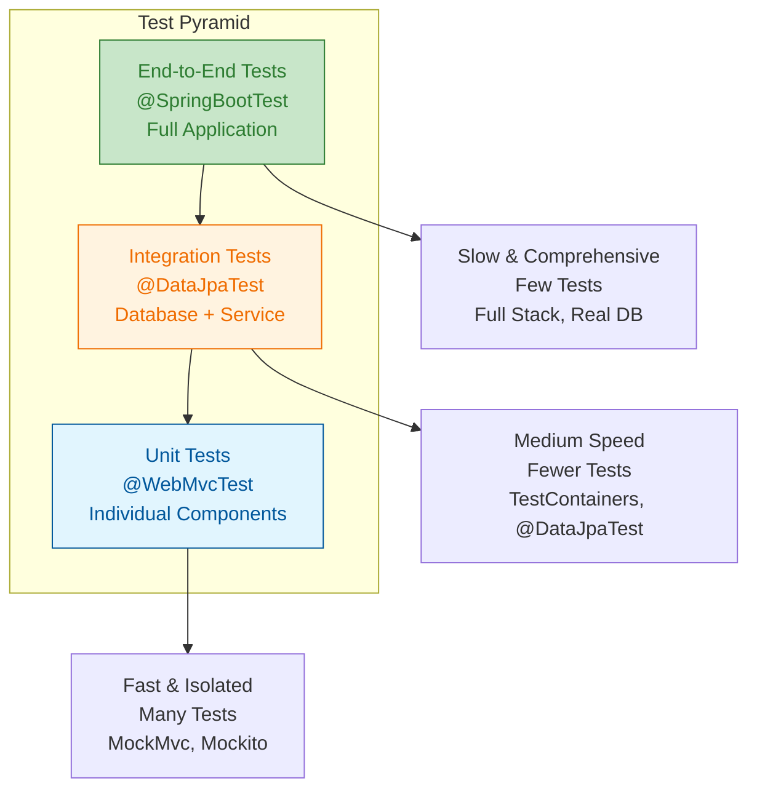
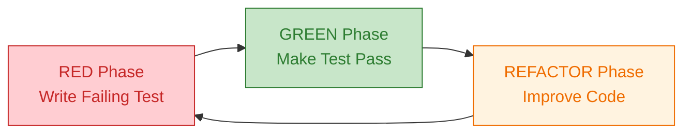
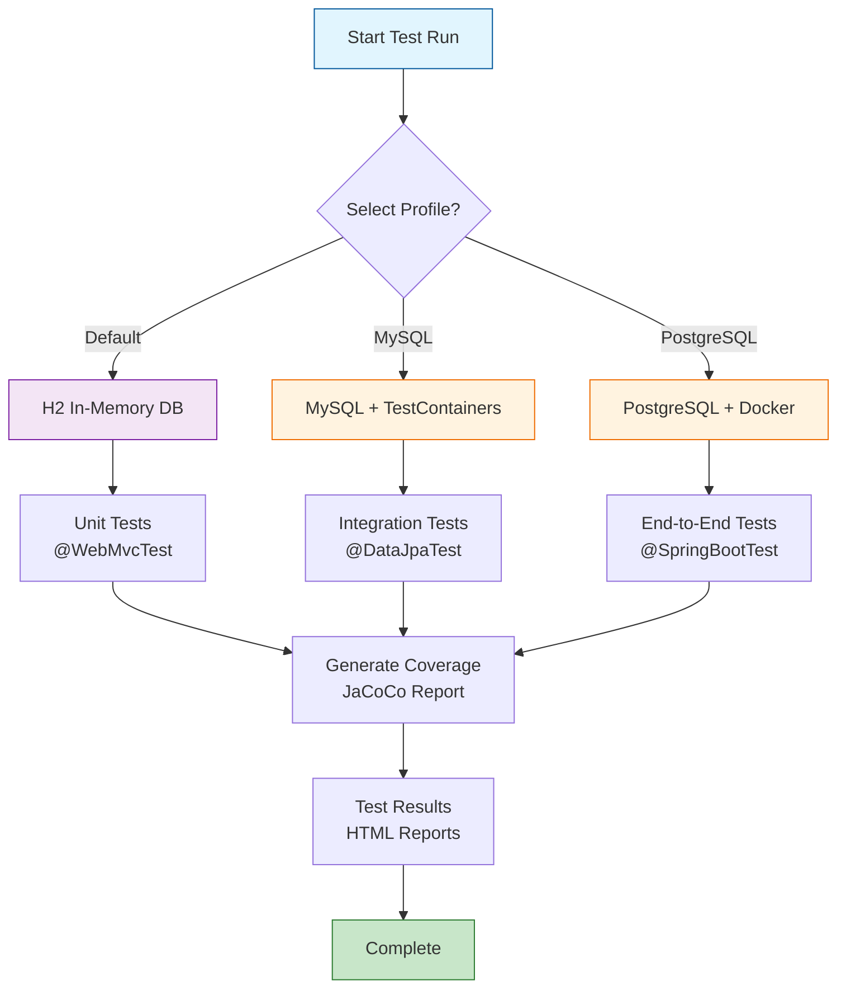

# Testing Guide

This comprehensive guide covers the testing strategy, implementation patterns, and best practices used in the Emerald Grove Veterinary Clinic application.

## Overview

The Emerald Grove Veterinary Clinic application employs a **Strict Test-Driven Development (TDD)** methodology with a multi-layered testing approach following the test pyramid principle. All feature implementations must follow the **Red-Green-Refactor** cycle:

1. **RED**: Write a failing test that defines the desired behavior
2. **GREEN**: Write the minimum code required to make the test pass
3. **REFACTOR**: Improve the code while maintaining test coverage

The test suite ensures code quality, prevents regressions, and validates application behavior across different layers and environments.

## Test Structure

```text
src/test/java/org/springframework/samples/petclinic/
├── PetClinicIntegrationTests.java     # Main integration tests
├── MySqlIntegrationTests.java         # MySQL-specific integration tests
├── PostgresIntegrationTests.java      # PostgreSQL-specific integration tests
├── MysqlTestApplication.java          # MySQL test application
├── model/                             # Model layer tests
│   └── ValidatorTests.java           # Bean validation tests
├── owner/                             # Owner module tests
│   ├── OwnerControllerTests.java     # Web layer tests
│   ├── PetControllerTests.java       # Pet controller tests
│   ├── PetTypeFormatterTests.java    # Formatter tests
│   ├── PetValidatorTests.java        # Custom validator tests
│   └── VisitControllerTests.java     # Visit controller tests
├── service/                           # Service layer tests
│   ├── ClinicServiceTests.java       # Data access tests
│   └── EntityUtils.java              # Test utilities
├── system/                            # System-level tests
│   ├── CrashControllerIntegrationTests.java
│   ├── CrashControllerTests.java
│   └── I18nPropertiesSyncTest.java
└── vet/                              # Vet module tests
    ├── VetControllerTests.java       # Vet controller tests
    └── VetTests.java                 # Vet entity tests
```

## Testing Types

The Emerald Grove Veterinary Clinic follows the test pyramid principle with different testing levels:



### 1. Unit Tests

Unit tests focus on individual components in isolation.

#### Model Layer Tests

**ValidatorTests.java** - Tests Bean Validation annotations:

```java
@Test
void shouldNotValidateWhenFirstNameEmpty() {
    LocaleContextHolder.setLocale(Locale.ENGLISH);
    Person person = new Person();
    person.setFirstName("");
    person.setLastName("smith");

    Validator validator = createValidator();
    Set<ConstraintViolation<Person>> constraintViolations = validator.validate(person);

    assertThat(constraintViolations).hasSize(1);
    ConstraintViolation<Person> violation = constraintViolations.iterator().next();
    assertThat(violation.getPropertyPath()).hasToString("firstName");
    assertThat(violation.getMessage()).isEqualTo("must not be blank");
}
```

**Key Patterns:**

- Test validation constraints individually
- Use AssertJ for fluent assertions
- Test with different locales for internationalization

### 2. Web Layer Tests

Web layer tests use Spring's MockMvc to test controllers without a running server.

#### Controller Test Structure

**OwnerControllerTests.java** demonstrates comprehensive web testing:

```java
@WebMvcTest(OwnerController.class)
@DisabledInNativeImage
@DisabledInAotMode
class OwnerControllerTests {

    @Autowired
    private MockMvc mockMvc;

    @MockitoBean
    private OwnerRepository owners;

    @Test
    void testInitCreationForm() throws Exception {
        mockMvc.perform(get("/owners/new"))
            .andExpect(status().isOk())
            .andExpect(model().attributeExists("owner"))
            .andExpect(view().name("owners/createOrUpdateOwnerForm"));
    }

    @Test
    void testProcessCreationFormSuccess() throws Exception {
        mockMvc
            .perform(post("/owners/new")
                .param("firstName", "Joe")
                .param("lastName", "Bloggs")
                .param("address", "123 Caramel Street")
                .param("city", "London")
                .param("telephone", "1316761638"))
            .andExpect(status().is3xxRedirection());
    }
}
```

**Key Features:**

- **@WebMvcTest**: Loads only web layer components
- **@MockitoBean**: Mocks dependencies for isolated testing
- **MockMvc**: Simulates HTTP requests without server overhead
- **Hamcrest Matchers**: Fluent response assertions
- **Form Testing**: Validates form submission and validation

### 3. Integration Tests

Integration tests verify interactions between multiple application layers.

#### Data Access Integration

**ClinicServiceTests.java** tests repository and service layers:

```java
@DataJpaTest
@AutoConfigureTestDatabase(replace = Replace.NONE)
class ClinicServiceTests {

    @Autowired
    protected OwnerRepository owners;

    @Autowired
    protected PetTypeRepository types;

    @Autowired
    protected VetRepository vets;

    private Pageable pageable = PageRequest.of(0, 10);

    @Test
    void shouldFindOwnersByLastName() {
        Page<Owner> owners = this.owners.findByLastNameStartingWith("Davis", pageable);
        assertThat(owners).hasSize(2);
    }

    @Test
    @Transactional
    void shouldInsertOwner() {
        Owner owner = new Owner();
        owner.setFirstName("Sam");
        owner.setLastName("Schultz");
        // ... set other properties
        this.owners.save(owner);
        assertThat(owner.getId()).isNotZero();
    }
}
```

**Key Annotations:**

- **@DataJpaTest**: Configures JPA repositories and embedded database
- **@AutoConfigureTestDatabase**: Controls test database configuration
- **@Transactional**: Ensures test isolation with automatic rollback

#### Application Integration

**PetClinicIntegrationTests.java** tests the full application:

```java
@SpringBootTest(webEnvironment = WebEnvironment.RANDOM_PORT)
public class PetClinicIntegrationTests {

    @LocalServerPort
    int port;

    @Autowired
    private VetRepository vets;

    @Autowired
    private RestTemplateBuilder builder;

    @Test
    void testFindAll() {
        vets.findAll();
        vets.findAll(); // served from cache
    }

    @Test
    void testOwnerDetails() {
        RestTemplate template = builder.rootUri("http://localhost:" + port).build();
        ResponseEntity<String> result = template.exchange(
            RequestEntity.get("/owners/1").build(), String.class);
        assertThat(result.getStatusCode()).isEqualTo(HttpStatus.OK);
    }

    public static void main(String[] args) {
        SpringApplication.run(PetClinicApplication.class, args);
    }
}
```

### 4. Database-Specific Tests

Tests for different database configurations using TestContainers.

#### MySQL Integration Tests

```java
@SpringBootTest(webEnvironment = WebEnvironment.RANDOM_PORT)
@ActiveProfiles("mysql")
@Testcontainers(disabledWithoutDocker = true)
@DisabledInNativeImage
@DisabledInAotMode
class MySqlIntegrationTests {

    @ServiceConnection
    @Container
    static MySQLContainer container = new MySQLContainer(DockerImageName.parse("mysql:9.5"));

    @Test
    void testFindAll() {
        vets.findAll();
        vets.findAll(); // served from cache
    }
}
```

**Key Features:**

- **@Testcontainers**: Manages Docker containers for tests
- **@ServiceConnection**: Auto-configures database connection
- **@ActiveProfiles**: Activates MySQL-specific configuration

## TDD Implementation Patterns

### Red-Green-Refactor Cycle



#### RED Phase - Write Failing Test

- **Define Behavior**: Write a test that clearly specifies what the code should do
- **Ensure Failure**: Verify the test fails for the correct reason
- **Single Responsibility**: Each test focuses on one specific behavior

#### GREEN Phase - Make Test Pass

- **Minimal Implementation**: Write only the code needed to pass the test
- **No Extra Features**: Avoid adding functionality beyond the test requirements
- **Quick Success**: Focus on making the test pass as quickly as possible

#### REFACTOR Phase - Improve Code

- **Maintain Green**: All tests must continue passing during refactoring
- **Improve Design**: Enhance code structure, readability, and maintainability
- **Eliminate Duplication**: Remove redundant code and improve abstractions

### TDD Test Structure

#### Arrange-Act-Assert Pattern

```java
@Test
@DisplayName("should create owner with valid data")
void shouldCreateOwnerWithValidData() {
    // Arrange
    Owner owner = new Owner();
    owner.setFirstName("John");
    owner.setLastName("Doe");
    owner.setAddress("123 Main St");
    owner.setCity("Anytown");
    owner.setTelephone("555-1234");

    // Act
    Owner savedOwner = ownerService.save(owner);

    // Assert
    assertThat(savedOwner.getId()).isNotNull();
    assertThat(savedOwner.getFirstName()).isEqualTo("John");
    assertThat(savedOwner.getLastName()).isEqualTo("Doe");
}
```

#### Test-First Example

```java
// 1. RED: Write failing test first
@Test
void shouldFindOwnerByEmailWhenEmailExists() {
    // Test fails because findByEmail doesn't exist yet
    Optional<Owner> result = ownerService.findByEmail("john@example.com");
    assertThat(result).isPresent();
}

// 2. GREEN: Implement minimal method
public Optional<Owner> findByEmail(String email) {
    return ownerRepository.findByEmail(email);
}

// 3. REFACTOR: Improve implementation with validation
public Optional<Owner> findByEmail(String email) {
    if (email == null || email.trim().isEmpty()) {
        return Optional.empty();
    }
    return ownerRepository.findByEmail(email.toLowerCase());
}
```

### Test Data Management

#### Test Data Architecture

The test data management system follows a structured approach:

```mermaid
flowchart TD
    subgraph "Test Data Layer"
        Factory[Test Data Factory<br/>george(), createPet()]
        Utils[Entity Utils<br/>getById(), validate()]
        Fixtures[Data Fixtures<br/>Sample Owners, Pets, Vets]
    end

    subgraph "Test Execution"
        Setup[Setup Test Data<br/>@BeforeEach]
        Execute[Run Test<br/>MockMvc, @DataJpaTest]
        Cleanup[Cleanup<br/>@Transactional Rollback]
    end

    subgraph "Data Sources"
        H2[H2 In-Memory<br/>Auto-populated]
        MySQL[MySQL TestContainer<br/>Docker Instance]
        PG[PostgreSQL<br/>Docker Compose]
    end

    Factory --> Setup
    Utils --> Setup
    Fixtures --> Setup

    Setup --> Execute
    Execute --> Cleanup

    H2 -.-> Execute
    MySQL -.-> Execute
    PG -.-> Execute

    style Factory fill:#e1f5fe,stroke:#01579b
    style Utils fill:#e1f5fe,stroke:#01579b
    style Fixtures fill:#e1f5fe,stroke:#01579b
    style Setup fill:#fff3e0,stroke:#ef6c00
    style Cleanup fill:#c8e6c9,stroke:#2e7d32
    style H2 fill:#f5f5f5,stroke:#424242
    style MySQL fill:#f5f5f5,stroke:#424242
    style PG fill:#f5f5f5,stroke:#424242
```

#### Test Fixtures

Create reusable test data factories:

```java
private Owner george() {
    Owner george = new Owner();
    george.setId(TEST_OWNER_ID);
    george.setFirstName("George");
    george.setLastName("Franklin");
    george.setAddress("110 W. Liberty St.");
    george.setCity("Madison");
    george.setTelephone("6085551023");

    Pet max = new Pet();
    PetType dog = new PetType();
    dog.setName("dog");
    max.setType(dog);
    max.setName("Max");
    max.setBirthDate(LocalDate.now());
    george.addPet(max);
    max.setId(1);
    return george;
}
```

#### Entity Utilities

Helper methods for test data manipulation:

```java
public class EntityUtils {
    public static <T> T getById(Collection<T> collection, Class<T> type, int id) {
        return collection.stream()
            .filter(entity -> {
                try {
                    return type.getMethod("getId").invoke(entity).equals(id);
                } catch (Exception e) {
                    throw new RuntimeException(e);
                }
            })
            .findFirst()
            .orElseThrow(() -> new AssertionError("Entity not found"));
    }
}
```

### Mocking Strategies

#### Repository Mocking

Use Mockito for isolating components:

```java
@MockitoBean
private OwnerRepository owners;

@BeforeEach
void setup() {
    Owner george = george();
    given(this.owners.findByLastNameStartingWith(eq("Franklin"), any(Pageable.class)))
        .willReturn(new PageImpl<>(List.of(george)));

    given(this.owners.findById(TEST_OWNER_ID)).willReturn(Optional.of(george));
}
```

#### Behavior Verification

Verify interactions and behavior:

```java
@Test
void testProcessUpdateOwnerFormSuccess() throws Exception {
    mockMvc.perform(post("/owners/{ownerId}/edit", TEST_OWNER_ID)
        .param("firstName", "Joe")
        .param("lastName", "Bloggs"))
        .andExpect(status().is3xxRedirection())
        .andExpect(view().name("redirect:/owners/{ownerId}"));
}
```

### Assertion Patterns

#### Fluent Assertions with AssertJ

```java
@Test
void shouldFindSingleOwnerWithPet() {
    Optional<Owner> optionalOwner = this.owners.findById(1);
    assertThat(optionalOwner).isPresent();
    Owner owner = optionalOwner.get();

    assertThat(owner.getLastName()).startsWith("Franklin");
    assertThat(owner.getPets()).hasSize(1);
    assertThat(owner.getPets().get(0).getType()).isNotNull();
    assertThat(owner.getPets().get(0).getType().getName()).isEqualTo("cat");
}
```

#### Response Validation

Comprehensive HTTP response testing:

```java
mockMvc.perform(get("/owners/{ownerId}", TEST_OWNER_ID))
    .andExpect(status().isOk())
    .andExpect(model().attribute("owner", hasProperty("lastName", is("Franklin"))))
    .andExpect(model().attribute("owner", hasProperty("pets", not(empty()))))
    .andExpect(view().name("owners/ownerDetails"));
```

## Running Tests

### Test Execution Flow

The test execution process follows a structured approach:



### Execute All Tests

```bash
# Maven
./mvnw test

# Gradle
./gradlew test
```

### Run Specific Test Classes

```bash
# Maven
./mvnw test -Dtest=OwnerControllerTests
./mvnw test -Dtest="*ControllerTests"

# Gradle
./gradlew test --tests OwnerControllerTests
./gradlew test --tests "*ControllerTests"
```

### Run Integration Tests Only

```bash
# Maven
./mvnw test -Dtest="*IntegrationTests"

# Gradle
./gradlew test --tests "*IntegrationTests"
```

### Database-Specific Tests

```bash
# MySQL tests (requires Docker)
./mvnw test -Dtest=MySqlIntegrationTests -Dspring.profiles.active=mysql

# PostgreSQL tests (requires Docker)
./mvnw test -Dtest=PostgresIntegrationTests -Dspring.profiles.active=postgres
```

## Test Configuration

### Test Profiles

Different configurations for testing scenarios:

- **default**: H2 in-memory database
- **mysql**: MySQL with TestContainers
- **postgres**: PostgreSQL with Docker Compose

### Test Properties

Override properties for testing:

```properties
# application-test.properties
spring.datasource.url=jdbc:h2:mem:testdb
spring.jpa.hibernate.ddl-auto=create-drop
spring.test.database.replace=none
```

### Test Dependencies

Key testing dependencies in `pom.xml`:

```xml
<dependencies>
    <dependency>
        <groupId>org.springframework.boot</groupId>
        <artifactId>spring-boot-starter-test</artifactId>
        <scope>test</scope>
    </dependency>
    <dependency>
        <groupId>org.springframework.boot</groupId>
        <artifactId>spring-boot-testcontainers</artifactId>
        <scope>test</scope>
    </dependency>
    <dependency>
        <groupId>org.testcontainers</groupId>
        <artifactId>mysql</artifactId>
        <scope>test</scope>
    </dependency>
</dependencies>
```

## Test Coverage

### Coverage Goals

Maintain high test coverage across all layers:

- **Controllers**: 90%+ coverage
- **Services**: 85%+ coverage
- **Repositories**: 80%+ coverage
- **Models**: 75%+ coverage

### Coverage Reports

Generate coverage reports:

```bash
# Maven with JaCoCo
./mvnw clean test jacoco:report

# View report
open target/site/jacoco/index.html
```

### Coverage Configuration

JaCoCo configuration in `pom.xml`:

```xml
<plugin>
    <groupId>org.jacoco</groupId>
    <artifactId>jacoco-maven-plugin</artifactId>
    <version>0.8.14</version>
    <executions>
        <execution>
            <goals>
                <goal>prepare-agent</goal>
            </goals>
        </execution>
        <execution>
            <id>report</id>
            <phase>test</phase>
            <goals>
                <goal>report</goal>
            </goals>
        </execution>
    </executions>
</plugin>
```

## Continuous Integration

### GitHub Actions

Test automation in CI/CD pipeline:

```yaml
name: Tests
on: [push, pull_request]
jobs:
  test:
    runs-on: ubuntu-latest
    steps:
    - uses: actions/checkout@v3
    - name: Set up JDK 17
      uses: actions/setup-java@v3
      with:
        java-version: '17'
    - name: Run tests
      run: ./mvnw test
    - name: Generate coverage report
      run: ./mvnw jacoco:report
```

### Test Environments

Different test environments:

- **Local**: H2 database for fast feedback
- **CI**: Multiple database configurations
- **Staging**: Production-like environment

## Best Practices

### Test Organization

1. **Naming Conventions**: Use descriptive test method names
2. **Test Structure**: Arrange-Act-Assert pattern
3. **Test Independence**: Tests should not depend on each other
4. **Test Data**: Use factories for consistent test data

### Performance Considerations

1. **Test Speed**: Use in-memory databases for unit tests
2. **Parallel Execution**: Configure tests to run in parallel
3. **Test Isolation**: Use transactions and rollback
4. **Resource Management**: Clean up resources after tests

### Maintenance Guidelines

1. **Regular Updates**: Keep test dependencies current
2. **Refactoring**: Refactor tests when code changes
3. **Documentation**: Document complex test scenarios
4. **Monitoring**: Monitor test execution times and flakiness

## Troubleshooting

### Common Issues

#### Test Container Failures

```bash
# Docker not running
sudo systemctl start docker

# Permission issues
sudo usermod -aG docker $USER
```

#### Database Connection Issues

```bash
# Check profile configuration
./mvnw test -Dspring.profiles.active=test -Dspring.datasource.url=jdbc:h2:mem:testdb
```

#### Mock Issues

```java
// Verify mock setup
@MockitoBean
private OwnerRepository owners;

@BeforeEach
void setup() {
    // Clear previous interactions
    Mockito.reset(owners);
    // Setup new behavior
    given(owners.findById(1)).willReturn(Optional.of(testOwner));
}
```

### Debug Mode

Run tests with debug logging:

```bash
./mvnw test -Dspring-boot.run.jvmArguments="-Dlogging.level.org.springframework=DEBUG"
```

## Advanced Testing

### Custom Test Annotations

Create reusable test configurations:

```java
@Target(ElementType.TYPE)
@Retention(RetentionPolicy.RUNTIME)
@SpringBootTest(webEnvironment = WebEnvironment.RANDOM_PORT)
@ActiveProfiles("test")
public @interface IntegrationTest {
}
```

### Test Slicing

Use test slices for focused testing:

```java
@WebMvcTest(controllers = OwnerController.class)
@DataJpaTest
@JsonTest
```

### Performance Testing

Load testing with JMeter:

```bash
# Run JMeter tests
./mvnw verify -Pperformance
```

## End-to-End (E2E) Browser Tests (Playwright)

This repository includes a standalone Playwright + TypeScript E2E suite under `e2e-tests/`. These tests validate critical user journeys through a real browser and are intentionally separate from the Java unit/integration tests.

### Prerequisites

- Java 17+
- Node.js + npm
- (Recommended) Docker if you run DB profiles, though default H2 works fine

### Running Locally

1. **Start the app (optional)**

    The Playwright config is set to start Spring Boot automatically via Maven:

    ```bash
    ./mvnw spring-boot:run
    ```

    If you already have the app running, Playwright will reuse it.

2. **Install E2E dependencies**

    ```bash
    cd e2e-tests
    npm ci
    npx playwright install
    ```

    Note: On some Linux distros Playwright may require additional system libraries. If browsers fail to launch, install deps via:

    ```bash
    sudo npx playwright install-deps
    ```

3. **Run tests**

    ```bash
    npm test
    ```

### Scripts

The E2E suite is a standalone Node.js project. To run package scripts, use `npm run <script>`.

- **`npm test`**: Run the full E2E suite.
- **`npm run test:ui`**: Run tests using Playwright's interactive UI mode.
- **`npm run test:headed`**: Run tests in headed mode.
- **`npm run test:debug`**: Run tests in headed mode with Playwright debugging enabled.
- **`npm run report`**: Open the Playwright HTML report.

### Targeted runs

```bash
npm test -- --grep "Owner Management"
npm test -- --grep "Pet Management"
npm test -- --grep "Vet Directory|Visit Scheduling"
```

### Debugging

```bash
npm run test:ui
npm run test:headed
npm run test:debug
```

### Reports & Artifacts

- HTML report: `e2e-tests/test-results/html-report/index.html`
- JUnit: `e2e-tests/test-results/junit.xml`
- JSON: `e2e-tests/test-results/results.json`
- Artifacts (traces/videos/screenshots on failure): `e2e-tests/test-results/artifacts/`

Open the report:

```bash
cd e2e-tests
npm run report
```

### Accessibility

A lightweight accessibility scan is available in `e2e-tests/tests/a11y/` and uses `axe-core` injected into the page.

### CI

GitHub Actions workflow: `.github/workflows/e2e-tests.yml`

CI uploads the Playwright HTML report and artifacts as workflow run artifacts.

This comprehensive testing strategy ensures the Emerald Grove Veterinary Clinic application maintains high code quality and reliability across different environments and use cases.
