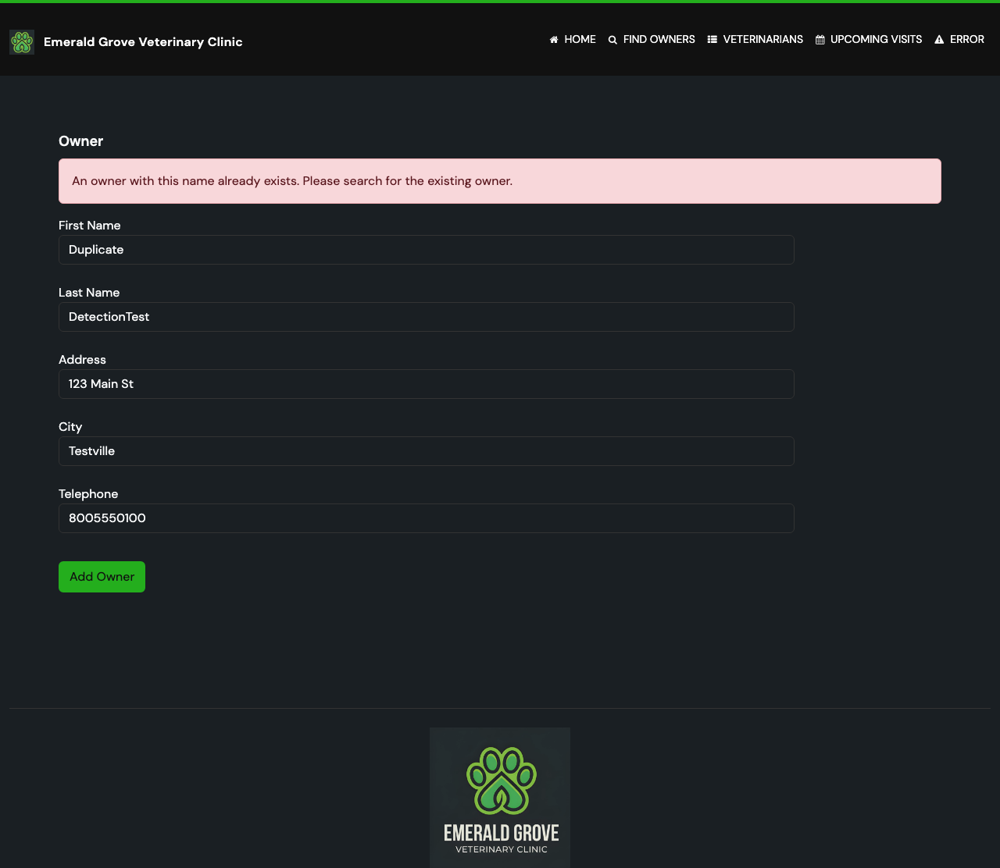
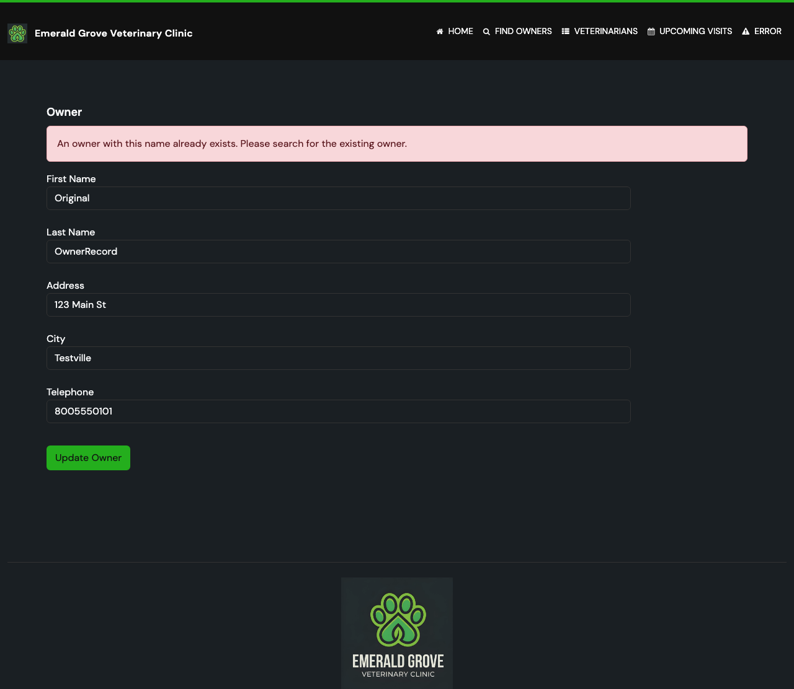

# Task 5.0 Proofs — Playwright E2E tests for duplicate owner prevention

## Summary

Task 5.0 adds end-to-end Playwright tests for both the create and edit duplicate prevention
scenarios. Both tests pass individually and as part of the full E2E suite with no regressions.

---

## E2E Test Run — Targeted

Command run:

```bash
npm test -- --grep "Duplicate Owner"
```

Output:

```text
Running 2 tests using 2 workers

  2 passed (2.6s)
```

---

## E2E Test Run — Full Suite (Regression Check)

Command run:

```bash
npm test
```

Output:

```text
  1 skipped
  30 passed (6.1s)
```

Zero failures across all 30 tests (1 pre-existing skip).

---

## Changes Made

### `e2e-tests/tests/pages/owner-page.ts`

Added `duplicateErrorBanner()` locator helper:

```typescript
duplicateErrorBanner(): Locator {
  return this.page.locator('.alert.alert-danger');
}
```

### `e2e-tests/tests/features/owner-management.spec.ts`

Added `Duplicate Owner Prevention` describe block with two tests:

1. **Create test**: Creates an owner using `createOwner()` with random telephone, submits the form
   twice with the exact same data, asserts the error banner is visible with the correct message.
2. **Edit test**: Creates two owners with random telephones, edits the second owner's
   name+telephone to match the first owner's, asserts the error banner is visible.

**Note on design:** Random telephones (from `createOwner()`) are used rather than fixed values to
prevent collisions when the full suite runs against a warm in-memory database where previous test
runs have already created owners. The same `owner` object is reused for both the create and the
duplicate attempt, ensuring an exact match.

---

## Screenshots

### Create Duplicate Error



The create form shows the red alert banner: "An owner with this name already exists.
Please search for the existing owner." Form fields remain populated with the submitted data.

### Edit Duplicate Error



The edit form shows the same red alert banner after attempting to rename an owner to a
name+telephone already held by a different owner. The "Update Owner" button confirms this
is the edit form path.

---

## Verification

- [x] `Duplicate Owner Prevention` describe block added to `owner-management.spec.ts`
- [x] `duplicateErrorBanner()` method added to `OwnerPage` page object
- [x] Create duplicate test passes — banner visible with correct text
- [x] Edit duplicate test passes — banner visible with correct text
- [x] Full E2E suite: 30 passed, 0 failed (no regressions)
- [x] Screenshots saved to `08-proofs/05-e2e-create-duplicate.png` and `08-proofs/05-e2e-edit-duplicate.png`
