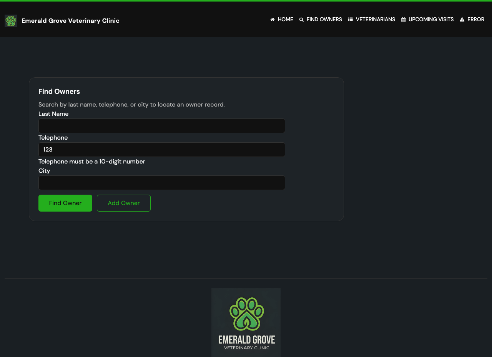

# Spec 09 — Task 3.0 Proof Artifacts

## Task: Add inline telephone validation to the search form

---

## Screenshot

### Telephone Validation Error

`find-owners-telephone-validation-error.png` — Shows the Find Owners form after submitting `"123"` in the Telephone field. An inline error message is displayed beneath the Telephone input.



---

## CLI Output

```bash
./mvnw test -Dtest=OwnerControllerTests -q
```

```text
Tests run: 33, Failures: 0, Errors: 0, Skipped: 0

BUILD SUCCESS
```

---

## Test Results

`OwnerControllerTests` — 33 tests, all passing.

New tests covering telephone validation:

| Test Method | Assertion |
|---|---|
| `testProcessFindFormInvalidTelephone` | `GET /owners?telephone=123` → status 200, view `owners/findOwners`, field error on `telephone` with code `telephone.invalid` |
| `testProcessFindFormEmptyTelephoneNoError` | `GET /owners?page=1` (no telephone) → no `telephone` field error (only global not-found error) |
| `testProcessFindFormValidTelephoneNoError` | `GET /owners?telephone=6085551023` → redirect (valid telephone, no rejection) |

---

## Controller Validation Logic

```java
// OwnerController.java — processFindForm
if (telephone != null && !telephone.matches("\\d{10}")) {
    result.rejectValue("telephone", "telephone.invalid");
    return "owners/findOwners";
}
```

Validation fires **before** the repository call. Empty/blank telephone passes through as `null` (no error).

---

## Template Error Display

```html
<!-- findOwners.html — inside #telephoneGroup -->
<div th:if="${#fields.hasErrors('telephone')}" class="help-inline">
  <p th:each="err : ${#fields.errors('telephone')}" th:text="${err}">Error</p>
</div>
```

---

## i18n Key

`messages.properties`:

```properties
telephone.invalid=Telephone number must be 10 digits
```

All 8 locale files contain a translated equivalent.

---

## Verification

- Entering `"123"` in Telephone field and submitting shows inline error containing "10-digit" (or locale equivalent)
- Valid 10-digit telephone proceeds to search without error
- Blank telephone field is ignored — no validation error triggered
